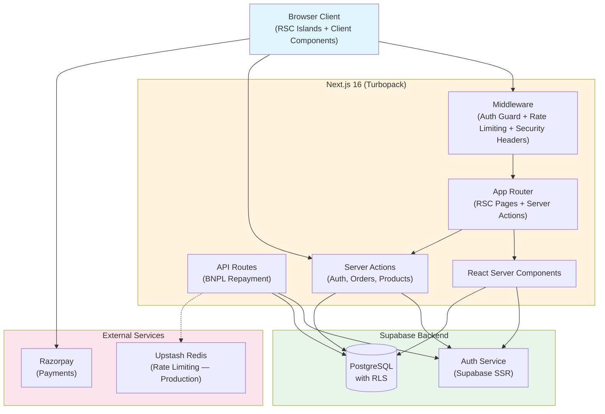

# Dilip Da — Homestyle Bengali Cuisine


A food ordering platform built with Next.js 16, Supabase, and TypeScript. Features **Ethics Pay BNPL** (Buy Now, Pay Later) credit system for students.

## Features

- **Role-based dashboards** — Student, Merchant, Delivery, Admin
- **BNPL Credit System** — Buy now, pay later with automated repayment schedules
- **Real-time Order Tracking** — Track orders from preparation to delivery
- **Razorpay Integration** — Secure card payments
- **Google OAuth** — One-click sign-in
- **Server Components** — RSC-first architecture for fast page loads
- **Security** — CSRF protection, rate limiting, Zod validation, RLS policies

## Quick Start

```bash
# 1. Clone and install
npm install

# 2. Set up environment
cp .env.example .env.local
# Fill in your Supabase URL and keys

# 3. Run migrations
# Execute supabase/migrations/*.sql against your Supabase database

# 4. Start developing
npm run dev
```

## Architecture



## Scripts

| Command | Description |
|---|---|
| `npm run dev` | Start dev server with Turbopack |
| `npm run build` | Production build |
| `npm run start` | Start production server |
| `npm run lint` | Run ESLint |
| `npm run typecheck` | TypeScript type checking |
| `npm run format` | Format with Prettier |
| `npm test` | Run Vitest unit/integration tests |
| `npm run test:coverage` | Run tests with coverage report |
| `npm run test:e2e` | Run Playwright E2E tests |

## Project Structure

```
src/
├── app/                    # Next.js App Router pages (RSC-first)
├── components/             # Shared & landing components
├── features/               # Feature modules (auth, bnpl, cart, etc.)
│   ├── auth/               # Auth, onboarding, role management
│   ├── bnpl/               # Ethics Pay BNPL system
│   ├── cart/               # Shopping cart (Zustand)
│   ├── payments/           # Razorpay integration
│   ├── products/           # Menu & categories
│   ├── restaurants/        # Restaurant management
│   └── orders/             # Order lifecycle
├── infrastructure/         # Supabase clients, DB schema types
├── lib/                    # Rate limiter, CSRF, logger
├── schemas/                # Zod validation schemas
└── config/                 # Environment configuration
```

## Role-Based Access

| Role | Access |
|---|---|
| `student` | Order food, manage BNPL credit |
| `merchant` | Manage restaurant, menu, orders |
| `delivery` | View & update delivery assignments |
| `admin` | Full platform management |
| `super_admin` | Same as admin |

## Documentation

| Document | Description |
|---|---|
| [ARCHITECTURE.md](./ARCHITECTURE.md) | System architecture and design patterns |
| [DEPLOYMENT.md](./DEPLOYMENT.md) | Deployment guide for Vercel and manual servers |
| [SECURITY.md](./SECURITY.md) | Security overview, auth, RLS, and hardening |
| [DATABASE.md](./DATABASE.md) | Database schema, indexes, RLS policies, BNPL ledger |
| [API.md](./API.md) | Server actions, API routes, rate limit tiers |
| [FOLDER_STRUCTURE.md](./FOLDER_STRUCTURE.md) | Annotated project directory structure |
| [.env.example](./.env.example) | Environment variable reference |

## Deployment

Deploy to Vercel with one click, or run on any Node.js server. See [DEPLOYMENT.md](./DEPLOYMENT.md) for details.

## License

Private — Dilip Da
